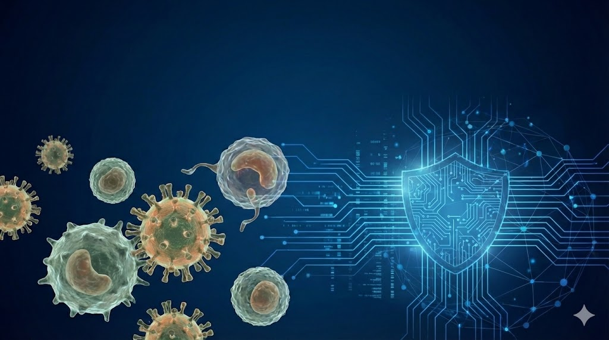
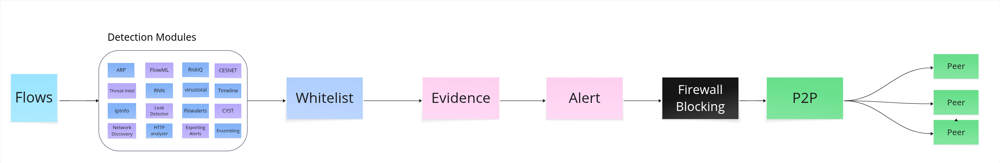
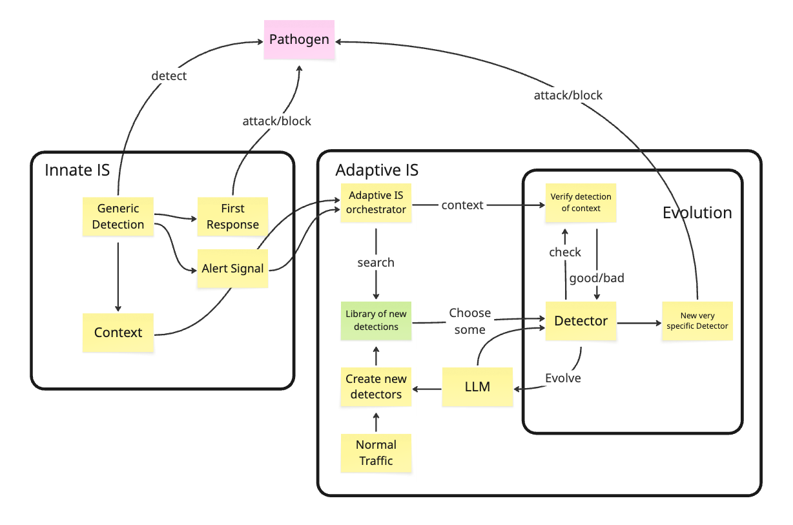
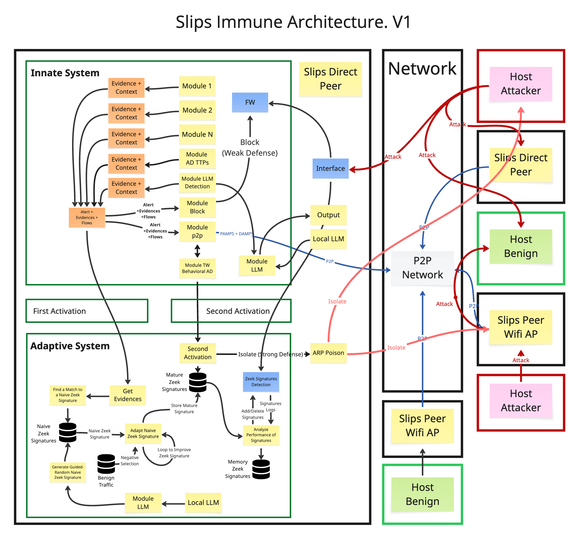

# What AI and Cybersecurity Can Learn from the Immune System

### From biological principles to SLIPS code

- General-audience seminar for AI and IT people
- 30 minutes
- Goal: extract reusable engineering principles, not teach immunology

# Why this topic should matter outside cybersecurity

- Many AI systems must act under uncertainty, with noisy and incomplete evidence
- Many operational systems must avoid two failures at once:
  - miss a real threat
  - overreact and damage normal operations
- Biology has been solving this tradeoff for a very long time

{ width=45% }

# Nature-inspired research: useful, but easy to do badly

- Bad version: copy a biological term and attach it to one algorithm
- Better version: ask what control problem biology is solving
- Best version: transfer the principle, then redesign it for engineering constraints

### The claim of this talk

The immune system is interesting as an architecture for decision-making, coordination, and regulation.

# The engineering problem in network detection

- Networks are noisy, distributed, and only partially observable
- Signals are weak when seen in isolation
- Attackers adapt, hide, and blend with benign behavior
- False positives are expensive for operators
- One alert is rarely enough to justify a strong action

# Why current cyber detection often disappoints

- Too much focus on isolated detectors
- Too little context shared across components
- Novelty is often confused with danger
- Escalation is not proportional
- Shutdown and rollback are usually an afterthought

### Result

Alert fatigue, brittle automation, and defenses that can become disruptive themselves.

# The immune system is not one detector

- It is a distributed, regulated decision system
- It combines local sensing with global coordination
- It uses multiple activation signals before strong response
- It adapts response strength to context
- It remembers what worked before
- It actively turns responses off

# Five principles worth stealing

1. Distributed sensing
2. Context propagation
3. Multi-signal activation
4. Adaptive aggressiveness and regulated shutdown
5. Memory and guided generation of new detectors

### These are useful in AI too

They apply to agent systems, retrieval systems, automated response, and any pipeline that must act safely under uncertainty.

# Principle 1: Distributed sensing

- In biology, no single cell sees the whole organism
- Robustness comes from many partial observers
- Local detection is cheap and continuous
- Strong action depends on coordination

### Transferable idea

Design systems as networks of specialized observers, not one perfect classifier.

# Principle 2: Context propagation

- A signal alone is weak
- What matters is where it happened, when, how often, and with what supporting evidence
- The immune system moves context through antigen presentation and signaling

### Transferable idea

Move summaries and evidence through the system, not just raw alerts.

{ width=70% }

# Principle 3: Multi-signal activation

- Recognition alone is not enough in biology
- Strong action requires corroboration
- This is how the immune system reduces false positives

### Transferable idea

Use gated decisions:

- detector hit
- evidence of actual damage or risk
- confidence from independent sources

# Principle 4: Adaptive aggressiveness and shutdown

- Not every anomaly deserves the same response
- Good systems scale response with risk
- Good systems also know when to stop

### Transferable idea

Prefer progressive actions:

- observe
- slow down
- isolate
- block

And make rollback a first-class feature.

# Principle 5: Memory and detector generation

- Biology stores useful experience
- It also keeps generating new detectors and filtering bad ones
- That matters because future threats are not fully known in advance

### Transferable idea

A useful system needs both:

- persistent memory of confirmed patterns
- controlled generation of candidate detectors

{ width=70% }

# Where cybersecurity got immunity wrong

- Earlier artificial immune systems often copied one mechanism at a time
- Many reduced the idea to anomaly detection plus biological naming
- They borrowed metaphors, but not the architecture

### The deeper mistake

They asked “which immune trick can detect attacks?” instead of “how does immunity coordinate uncertain evidence safely?”

# A better cyber-immune interpretation

Use immunity as a design reference for:

- distributed coordination
- context-aware evidence
- multi-signal gating
- proportional response
- memory
- termination

### Important caveat

Computers are not organisms. Principles transfer. Literal biological copying usually does not.

# How SLIPS starts transferring these principles

- Many modules already act as distributed sensors
- Evidence is pushed into a shared pipeline
- Alerts are based on accumulated evidence, not one event alone
- The current research branch adds more explicit immune-inspired structure

{ width=72% }

# Current branch: immune-signature-generation

### 1. Evidence signals

- Each evidence item now carries an `evidence_signal`
- Current signals:
  - `PAMP` for attack-pattern-like evidence
  - `DAMP` for damage or harm-related evidence
- This makes stronger multi-signal reasoning possible

### 2. Shared LLM service

- One shared module provides controlled access to local or remote LLM backends
- Other modules request generation through Redis channels

# Current branch: safer detector generation

### RegexGenerator module

- Generates candidate signatures one at a time with an LLM
- Validates syntax and rejects dangerous regexes
- Tests against a benign corpus
- Stores accepted patterns in SQLite for reuse

### Why this is immune-like

- guided random generation
- selection and rejection
- memory of accepted detectors

# Why this should interest AI people

- Multi-agent systems need distributed sensing
- LLM applications need gating before action
- Safety requires proportional escalation
- Memory should improve future decisions, not just store logs
- Good autonomy depends as much on shutdown as on activation

# Takeaways

- Nature-inspired research is useful when it transfers principles, not slogans
- The immune system offers a strong model for decision-making under uncertainty
- Cybersecurity has often copied the wrong layer of the analogy
- SLIPS shows one path from principle to implementation

### Final message

If you build AI systems that must decide and act safely, immunology is worth studying.

# Questions

### One question to leave with

What would change in our AI systems if we designed them more like regulated immune systems and less like isolated predictors?
